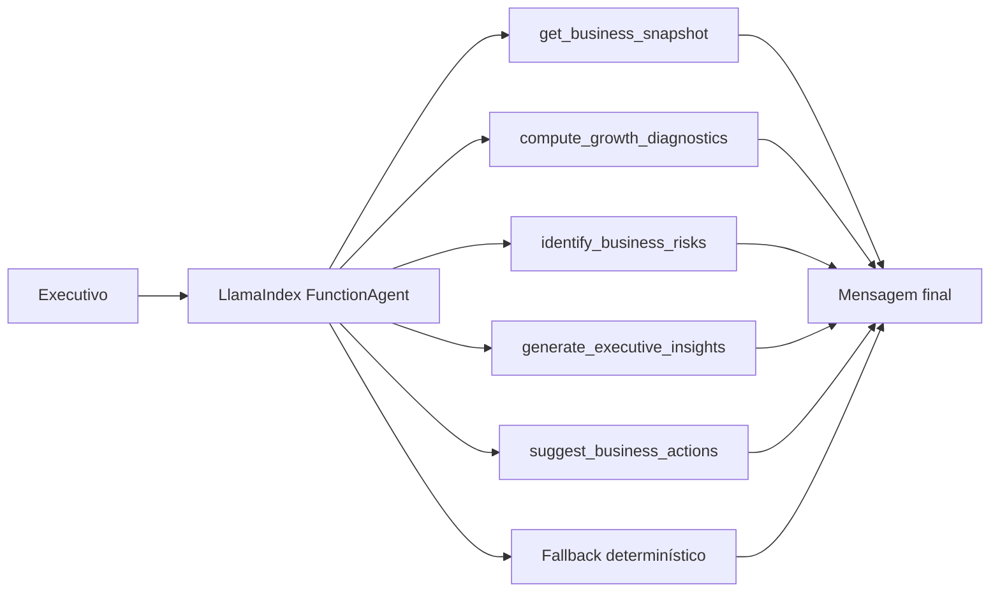

# Agente Insights

Um MVP de `LlamaIndex Agents` para geração de insights de negócio a partir de snapshots executivos com métricas de receita, retenção, margem, carga operacional e sinais de eficiência. O projeto foi desenhado para responder perguntas de liderança usando uma camada de tools analíticas e um runtime baseado em agente, com fallback determinístico para execução local.

## Visão Geral

O sistema responde perguntas como:

- quais sinais do trimestre merecem ir para a diretoria?
- estamos crescendo com qualidade ou apenas pressionando a operação?
- onde estão os principais riscos de churn, CAC ou eficiência?
- quais ações deveríamos priorizar no próximo ciclo?

## Arquitetura



## Topologia de Execução

O projeto foi estruturado em quatro camadas:

1. `snapshot layer`
   - consolida o retrato do negócio por período;
2. `analytics tools layer`
   - calcula crescimento, receita por cliente, carga de suporte e flags de risco;
3. `agent orchestration layer`
   - usa `LlamaIndex FunctionAgent` quando o runtime está disponível;
4. `presentation layer`
   - expõe o fluxo via `CLI` e `Streamlit`.

## Estrutura do Projeto

- [src/sample_data.py](/Users/flaviagaia/Documents/CV_FLAVIA_CODEX/agente_insights/src/sample_data.py)
  - base demo de snapshots de negócio.
- [src/tools.py](/Users/flaviagaia/Documents/CV_FLAVIA_CODEX/agente_insights/src/tools.py)
  - ferramentas analíticas e geradoras de insight.
- [src/agent.py](/Users/flaviagaia/Documents/CV_FLAVIA_CODEX/agente_insights/src/agent.py)
  - orquestração com `LlamaIndex Agents` e fallback.
- [app.py](/Users/flaviagaia/Documents/CV_FLAVIA_CODEX/agente_insights/app.py)
  - console de inspeção técnica em `Streamlit`.
- [main.py](/Users/flaviagaia/Documents/CV_FLAVIA_CODEX/agente_insights/main.py)
  - execução rápida e persistência do relatório.
- [tests/test_agent.py](/Users/flaviagaia/Documents/CV_FLAVIA_CODEX/agente_insights/tests/test_agent.py)
  - validação do fluxo central.

## Como o LlamaIndex Agent foi modelado

O runtime planejado usa:

- `FunctionAgent`
  - agente baseado em tools para respostas grounded;
- `FunctionTool`
  - wrapper das funções de domínio;
- `OpenAI`
  - backend de modelo quando há `OPENAI_API_KEY`.

### Tools registradas

- `get_business_snapshot`
- `compute_growth_diagnostics`
- `identify_business_risks`
- `generate_executive_insights`
- `suggest_business_actions`

### Runtime modes

1. `llamaindex_agent`
   - usado quando há runtime LlamaIndex funcional e chave de API;
2. `deterministic_fallback`
   - usado para execução local e reprodutível sem dependência externa.

## Ferramentas Analíticas

### `compute_growth_diagnostics`
Calcula:

- crescimento de receita (`growth_pct`);
- receita por cliente;
- carga de suporte por cliente;
- `risk_flags` executivas.

Formulações do MVP:

- `growth_pct = ((revenue_current - revenue_previous) / revenue_previous) * 100`
- `revenue_per_customer = revenue_current / active_customers`
- `support_load_per_customer = support_tickets / active_customers`

### `identify_business_risks`
Traduz os sinais quantitativos em:

- riscos executivos;
- oportunidades de crescimento ou eficiência.

### `generate_executive_insights`
Consolida os sinais em uma narrativa board-ready.

### `suggest_business_actions`
Produz um conjunto priorizado de ações táticas e executivas.

## Modelo de Dados

Os snapshots demo incluem:

- `company_id`
- `company_name`
- `sector`
- `period`
- `revenue_current`
- `revenue_previous`
- `gross_margin_pct`
- `active_customers`
- `new_customers`
- `churn_pct`
- `nps`
- `marketing_cac`
- `support_tickets`
- `on_time_delivery_pct`
- `inventory_turnover`
- `notes`

## Exemplo de Snapshot

```json
{
  "company_id": "BIZ-1002",
  "company_name": "RetailPulse",
  "sector": "Retail Analytics",
  "period": "2026-Q1",
  "revenue_current": 840000,
  "revenue_previous": 865000,
  "gross_margin_pct": 58.1,
  "active_customers": 288,
  "new_customers": 21,
  "churn_pct": 7.2,
  "nps": 31,
  "marketing_cac": 1120,
  "support_tickets": 710,
  "on_time_delivery_pct": 89.4,
  "inventory_turnover": 0.0,
  "notes": "Queda moderada de receita e churn pressionado por concorrência com menor preço."
}
```

## Contrato de Saída

`ask_business_insights_agent()` retorna:

```json
{
  "runtime_mode": "llamaindex_agent | deterministic_fallback",
  "company_id": "BIZ-1002",
  "snapshot": {},
  "diagnostics": {},
  "risks_and_opportunities": {},
  "executive_insight": "texto",
  "recommended_actions": {},
  "final_message": "texto final"
}
```

## Interface Streamlit

O app funciona como um `inspection console` para:

- escolher a empresa;
- submeter uma pergunta executiva;
- visualizar runtime, crescimento e receita por cliente;
- inspecionar diagnóstico, risco, oportunidades e snapshot.

## Execução Local

### Pipeline principal

```bash
python3 main.py
```

### Testes

```bash
python3 -m unittest discover -s tests -v
```

### Interface

```bash
streamlit run app.py
```

## Limitações

- a base é demo e pequena;
- o diagnóstico usa heurísticas simples;
- a execução agentic real depende do runtime `LlamaIndex`;
- o fallback é proposital para portabilidade local.

## English Version

`Agente Insights` is a `LlamaIndex Agents` MVP for executive business insight generation. The project combines structured business snapshots, analytical tools, and an agent-based orchestration layer to answer leadership questions about growth, churn, CAC pressure, operational quality, and prioritization. When the LlamaIndex runtime is unavailable, a deterministic fallback preserves the same output contract for local reproducibility.

### Technical Highlights

- `FunctionAgent` as the planned tool-calling runtime
- `FunctionTool` wrappers around business analytics functions
- deterministic fallback for local execution
- structured snapshot data as the grounding layer
- Streamlit inspection console
- persisted runtime artifact in `data/processed/business_insights_report.json`
